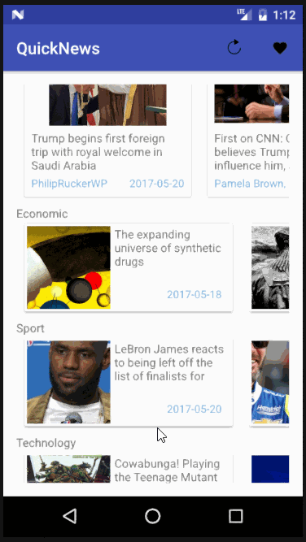
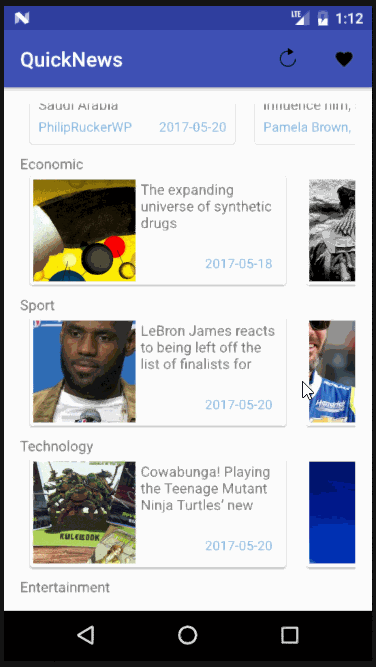

# QuickNews

## App interface

## To use:
Update the links on MainActivity.java

Ex. 

all/https://newsapi.org/v1/articles?source=google-news&sortBy=top&apiKey=b398178e1c244e17b18e7b1b601c7989

Format of the link
category/json link
